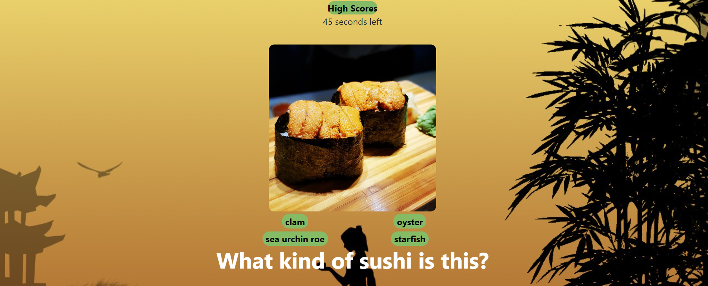

# sushi-quiz
This is a quiz about sushi! 
The user will press the start button, then they are given three seconds til the quiz begins.

The user will have 90 seconds to complete the quiz. 

Each question will be a picture of a type of sushi, and the user must make a selection out of four choices. For every correct answer, the score will increase by 5. For every wrong answer, the time will decrease by 10 seconds.

 At the end of the quiz, the time remaining will be added to the score. 

 Have fun!

